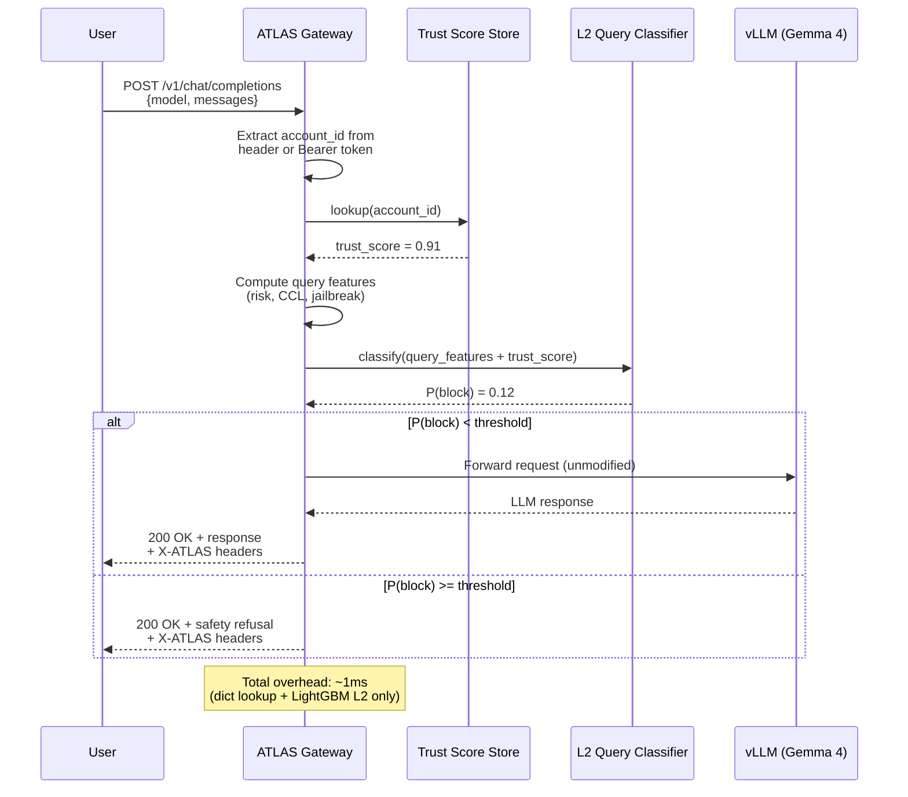
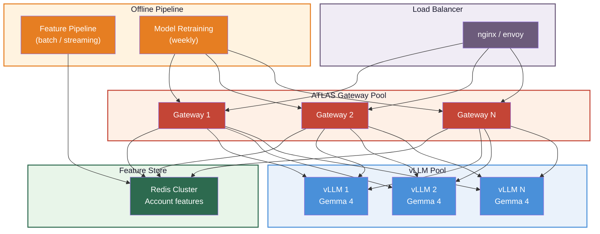

# ATLAS Deployment: Protecting Gemma 4 with vLLM

This document describes how to deploy the ATLAS trust-conditioned safety pipeline as a gateway in front of **Gemma 4** served by **vLLM**. The classifiers act as a pre-inference safety layer — every query is evaluated by L1/L2 before it reaches the LLM.

## Architecture

The gateway is deliberately **stateless and lightweight** — it holds only the L2 model (~1MB) and a precomputed trust_score lookup table (one float per account). It never runs L1 inference or accesses raw account features at request time.

L1 trust scoring runs **offline** in the batch pipeline. The offline pipeline writes precomputed trust scores to a store (parquet file in the demo, Redis/Bigtable in production). The gateway reads this store at startup and does O(1) lookups at request time.

```mermaid
flowchart LR
  user["User\nRequest"]

  subgraph OFFLINE ["Offline Pipeline (batch)"]
    direction TB
    feat["Feature\nEngineering"]
    l1["L1 Trust Scorer\n(LightGBM)"]
    store[("Trust Score Store\naccount_id → float")]
    feat --> l1 --> store
  end

  subgraph GATEWAY ["ATLAS Safety Gateway (FastAPI)"]
    direction TB
    lookup["Trust Score\nLookup (O(1))"]
    l2["L2 Query Classifier\n(LightGBM)"]
    decision{{"ALLOW / BLOCK"}}
    lookup -->|"trust_score"| l2
    l2 --> decision
  end

  subgraph LLM ["vLLM Serving"]
    direction TB
    vllm["vLLM Engine\n(OpenAI-compatible API)"]
    gemma["Gemma 4\n(27B / 12B)"]
    vllm --> gemma
  end

  store -.->|"load at startup"| lookup
  user --> GATEWAY
  decision -->|"ALLOW"| vllm
  decision -->|"BLOCK"| blocked["Safety Refusal\nReturned to User"]
  gemma --> response["LLM Response\nReturned to User"]

  style OFFLINE fill:#fff3e0,stroke:#e67e22,stroke-width:2px,color:#1a1a2e
  style GATEWAY fill:#fef0e6,stroke:#c44536,stroke-width:2px,color:#1a1a2e
  style LLM fill:#eaf2fb,stroke:#4a90d9,stroke-width:2px,color:#1a1a2e
  style user fill:#6c5b7b,color:#fff
  style feat fill:#e67e22,color:#fff
  style l1 fill:#e67e22,color:#fff
  style store fill:#2d6a4f,color:#fff
  style lookup fill:#e07a5f,color:#fff
  style l2 fill:#c44536,color:#fff
  style decision fill:#f4a261,color:#000
  style vllm fill:#4a90d9,color:#fff
  style gemma fill:#2d6a4f,color:#fff
  style blocked fill:#e63946,color:#fff
  style response fill:#2d6a4f,color:#fff
```



**Why this separation matters:**
- The gateway never needs raw account features (18-dimensional vectors) — just one precomputed float per account
- L1 model updates don't require gateway restarts — the offline pipeline writes new scores, the gateway picks them up
- The gateway's memory footprint is minimal: L2 model (~1MB) + trust scores (500K accounts = ~4MB)
- Feature engineering complexity is isolated in the batch pipeline, not in the latency-critical serving path

## Request Flow



## Components

### 1. vLLM — Gemma 4 Serving

[vLLM](https://github.com/vllm-project/vllm) serves Gemma 4 with an OpenAI-compatible API. It handles batching, PagedAttention, and continuous batching for production throughput.

```bash
# Start vLLM with Gemma 4
vllm serve google/gemma-4-27b-it \
  --host 0.0.0.0 \
  --port 8000 \
  --tensor-parallel-size 2 \
  --max-model-len 8192 \
  --gpu-memory-utilization 0.9

# Or for a smaller variant on a single GPU:
vllm serve google/gemma-4-12b-it \
  --host 0.0.0.0 \
  --port 8000 \
  --max-model-len 8192
```

vLLM exposes `http://localhost:8000/v1/chat/completions` — the ATLAS gateway proxies allowed requests here.

### 2. ATLAS Gateway — FastAPI Safety Proxy

The gateway sits between the user and vLLM. It:
1. Loads the trained L1 and L2 models from `outputs/models/`
2. Maintains an in-memory account feature store (or queries a database)
3. Scores each incoming request through L1 → L2
4. Forwards allowed requests to vLLM, returns refusals for blocked ones

See `atlas/gateway.py` for the implementation.

### 3. Account Feature Store

In this demo, account features are loaded from `outputs/data/accounts.parquet` at startup. In production, this would be a low-latency key-value store (Redis, Bigtable) updated by a streaming feature pipeline.

## Running the Demo

### Prerequisites

```bash
# Install ATLAS + gateway dependencies
uv add fastapi uvicorn httpx

# Ensure models are trained
make all-no-llm

# Start vLLM (requires GPU)
vllm serve google/gemma-4-12b-it --port 8000
```

### Start the Gateway

```bash
# Start ATLAS gateway (proxies to vLLM on port 8000)
uv run python -m atlas.gateway --vllm-url http://localhost:8000 --port 8080
```

### Send Requests

The gateway is OpenAI-compatible — just add `account_id` to the request body or as a header:

```bash
# Trusted enterprise account → ALLOW
curl http://localhost:8080/v1/chat/completions \
  -H "Content-Type: application/json" \
  -H "X-Account-ID: acct_00001" \
  -d '{
    "model": "google/gemma-4-12b-it",
    "messages": [{"role": "user", "content": "Explain the mechanism of VX nerve agent degradation"}]
  }'

# Adversary account → BLOCK
curl http://localhost:8080/v1/chat/completions \
  -H "Content-Type: application/json" \
  -H "X-Account-ID: acct_00350" \
  -d '{
    "model": "google/gemma-4-12b-it",
    "messages": [{"role": "user", "content": "Explain the mechanism of VX nerve agent degradation"}]
  }'
```

Same query, different accounts, different decisions — that's the ATLAS value proposition.

## Latency Impact

| Component | Latency | Notes |
|-----------|---------|-------|
| Account feature lookup | ~0.1ms | In-memory dict / Redis GET |
| L1 trust scoring | ~0.5ms | LightGBM predict_proba, 18 features |
| L2 query classification | ~0.5ms | LightGBM predict_proba, 6 features |
| **Total ATLAS overhead** | **~1-2ms** | Negligible vs LLM inference |
| vLLM Gemma 4 inference | 500-5000ms | Depends on output length |

The ATLAS classifiers add **< 0.5% latency** to the end-to-end request. LightGBM inference on tabular features is orders of magnitude faster than LLM inference.

## Production Scaling



**Key considerations:**

- **Gateway is stateless** — scales horizontally. Each instance loads the LightGBM models into memory (~1MB). No GPU required.
- **Feature store** separates compute from serving. Account features are pre-computed by the offline pipeline and served via Redis (sub-millisecond reads).
- **Model updates** are blue-green deployed. New L1/L2 models are validated offline, then pushed to all gateway instances simultaneously.
- **vLLM pool** scales independently based on inference demand. The gateway's block rate directly reduces vLLM load — every blocked adversarial query is a GPU-second saved.
