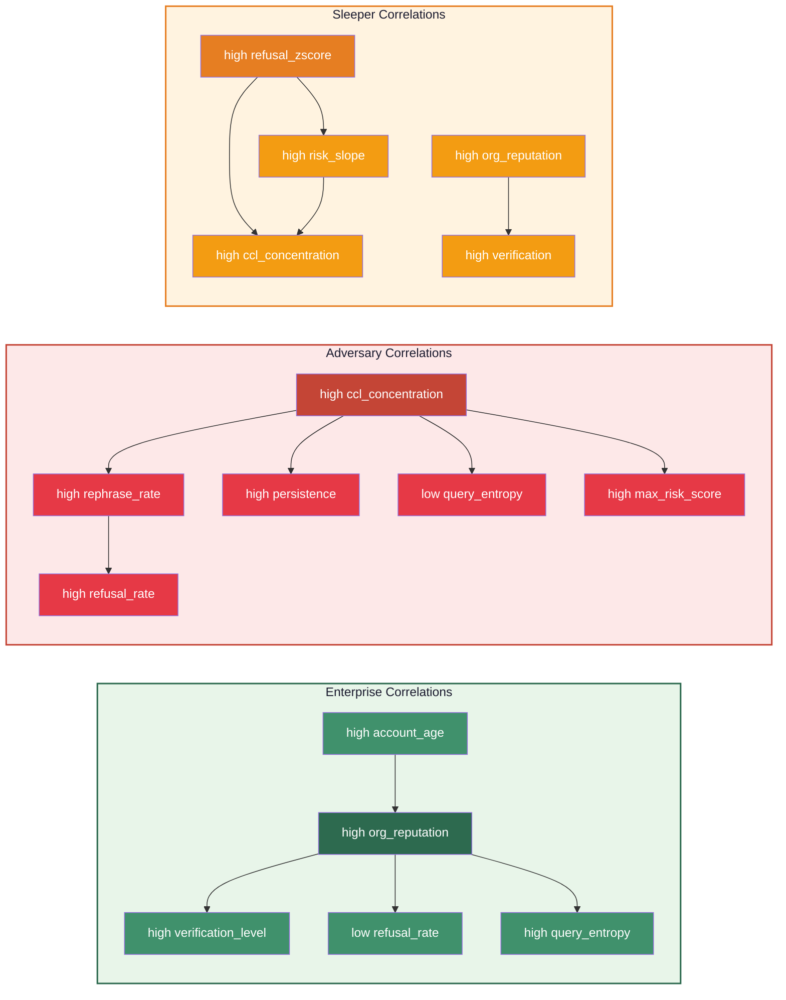

# ATLAS Feature Pipeline

The L1 trust scorer operates on an **18-dimensional feature vector** per account, organized into three groups: identity, behavioral, and session features.

## Feature Overview

```mermaid
flowchart TD
  subgraph IDENTITY ["Identity Features (5)"]
    direction TB
    id1["<b>account_age_days</b>\nContinuous — days since creation"]
    id2["<b>verification_level</b>\nOrdinal 0-3\nunverified → email → phone → KYC+org"]
    id3["<b>account_type</b>\nCategorical\nconsumer=0, api=1, enterprise=2"]
    id4["<b>org_reputation</b>\nContinuous 0-1\n0.0 for consumer, ~0.85 for enterprise"]
    id5["<b>access_path_risk</b>\nOrdinal 0-2\ndirect_app → direct_api → third_party_oauth"]
  end

  subgraph BEHAVIORAL ["Behavioral Features (8)"]
    direction TB
    bh1["<b>refusal_rate_7d</b>\nRefusals / total turns in 7-day window"]
    bh2["<b>refusal_rate_30d</b>\nRefusals / total turns in 30-day window"]
    bh3["<b>refusal_rate_zscore</b>\nZ-score of 7d rate vs historical baseline"]
    bh4["<b>rephrase_after_refusal_rate</b>\nRephrases after refusal / total refusals"]
    bh5["<b>query_entropy</b>\nShannon entropy of topic distribution"]
    bh6["<b>ccl_domain_concentration</b>\nFraction of turns in CCL domains"]
    bh7["<b>cross_session_persistence</b>\nCosine similarity between session topic vectors"]
    bh8["<b>channel_migration</b>\nBinary flag for access channel changes"]
  end

  subgraph SESSION ["Session Features (5)"]
    direction TB
    ss1["<b>max_risk_score_10sessions</b>\nMax of mean risk across last 10 sessions"]
    ss2["<b>risk_trend_slope</b>\nLinear regression slope of per-session risk"]
    ss3["<b>mean_topic_escalation</b>\nMean within-session risk level shift"]
    ss4["<b>mean_session_length</b>\nMean turns per session"]
    ss5["<b>burst_score</b>\nCoefficient of variation of inter-session gaps"]
  end

  IDENTITY --> L1
  BEHAVIORAL --> L1
  SESSION --> L1
  L1["<b>L1 Trust Scorer</b>\nLightGBM — 18 features\ntrust_score = P(benign)"]
  L1 --> TS{{"trust_score ∈ [0, 1]"}}

  style IDENTITY fill:#eaf2fb,stroke:#4a90d9,stroke-width:2px,color:#1a1a2e
  style BEHAVIORAL fill:#fef0e6,stroke:#e07a5f,stroke-width:2px,color:#1a1a2e
  style SESSION fill:#f0ecf5,stroke:#6c5b7b,stroke-width:2px,color:#1a1a2e
  style L1 fill:#c44536,color:#fff
  style TS fill:#f4a261,color:#000
  style id1 fill:#4a90d9,color:#fff
  style id2 fill:#4a90d9,color:#fff
  style id3 fill:#4a90d9,color:#fff
  style id4 fill:#4a90d9,color:#fff
  style id5 fill:#4a90d9,color:#fff
  style bh1 fill:#e07a5f,color:#fff
  style bh2 fill:#e07a5f,color:#fff
  style bh3 fill:#e07a5f,color:#fff
  style bh4 fill:#e07a5f,color:#fff
  style bh5 fill:#e07a5f,color:#fff
  style bh6 fill:#e07a5f,color:#fff
  style bh7 fill:#e07a5f,color:#fff
  style bh8 fill:#e07a5f,color:#fff
  style ss1 fill:#6c5b7b,color:#fff
  style ss2 fill:#6c5b7b,color:#fff
  style ss3 fill:#6c5b7b,color:#fff
  style ss4 fill:#6c5b7b,color:#fff
  style ss5 fill:#6c5b7b,color:#fff
```

## Feature Distributions by Archetype

| Feature | Clean Enterprise | Clean Consumer | Persistent Adversary | Sleeper (Phase 2) |
|---------|:---:|:---:|:---:|:---:|
| `account_age_days` | ~720 | ~365 | ~30 | ~540 |
| `verification_level` | 3 (KYC+org) | 1-2 | 0-1 | 2-3 |
| `account_type` | enterprise (2) | consumer (0) | consumer (0) | enterprise (2) |
| `org_reputation` | 0.85 | 0.0 | 0.1 | 0.75 |
| `access_path_risk` | 1 (API) | 0 (app) | 1-2 | 1 (API) |
| `refusal_rate_7d` | 0.02 | 0.01 | **0.35** | 0.25 |
| `refusal_rate_30d` | 0.015 | 0.008 | **0.30** | 0.15 |
| `refusal_rate_zscore` | 0.0 | 0.0 | 1.5 | **2.5** |
| `rephrase_after_refusal` | 0.1 | 0.05 | **0.7** | 0.4 |
| `query_entropy` | 1.5 | **2.8** | 0.8 | 1.8 |
| `ccl_domain_concentration` | 0.15 | 0.02 | **0.6** | 0.4 |
| `cross_session_persistence` | 0.7 | 0.3 | **0.85** | 0.6 |
| `channel_migration` | 0.05 | 0.02 | **0.3** | 0.15 |
| `max_risk_score_10sessions` | 0.3 | 0.15 | **0.85** | 0.7 |
| `risk_trend_slope` | 0.0 | 0.0 | 0.05 | **0.15** |
| `mean_topic_escalation` | 0.02 | 0.01 | **0.15** | 0.1 |
| `mean_session_length` | 8 | 5 | **15** | 10 |
| `burst_score` | 0.3 | 0.5 | **0.8** | 0.4 |

**Bold** = highest value for that feature. The key discriminating features are behavioral (refusal rates, CCL concentration, rephrase patterns) and session-level (risk scores, escalation trends).

## Feature Correlations

Features are not sampled independently — archetype-specific correlation matrices ensure realistic dependencies:

## L2 Query-Level Features

The L2 classifier uses 6 per-query features (5 baseline + trust_score from L1):

| Feature | Source | Description |
|---------|--------|-------------|
| `query_risk_raw` | Query content | Risk level: none=0, low=0.2, medium=0.5, high=0.8, critical=1.0 |
| `topic_is_ccl` | Query content | Binary: is the topic in {cybersecurity, weapons, manipulation, cbrn} |
| `jailbreak_technique_used` | Query content | Binary: any jailbreak technique detected |
| `turn_position` | Session context | Normalized position in session (0-1) |
| `session_refusal_count` | Session context | Cumulative refusals in current session |
| `trust_score` | **L1 output** | Account trust score [0,1] — the ATLAS signal |

The trust_score is the feature that disambiguates content-similar but intent-different queries across account types.
