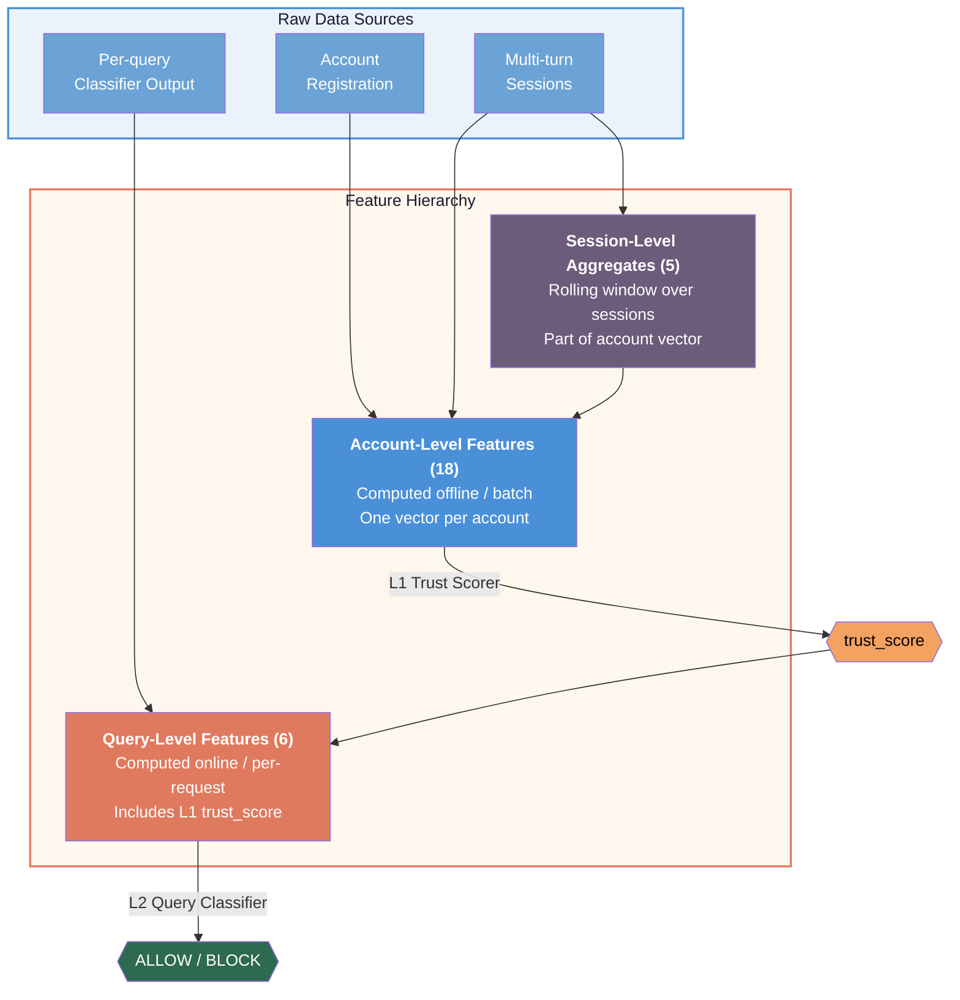
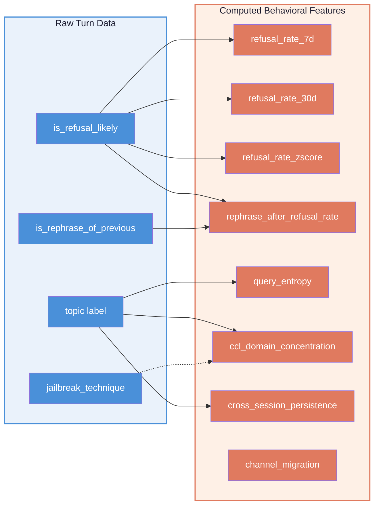
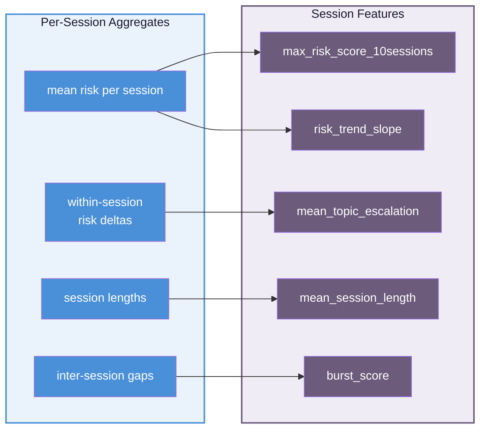
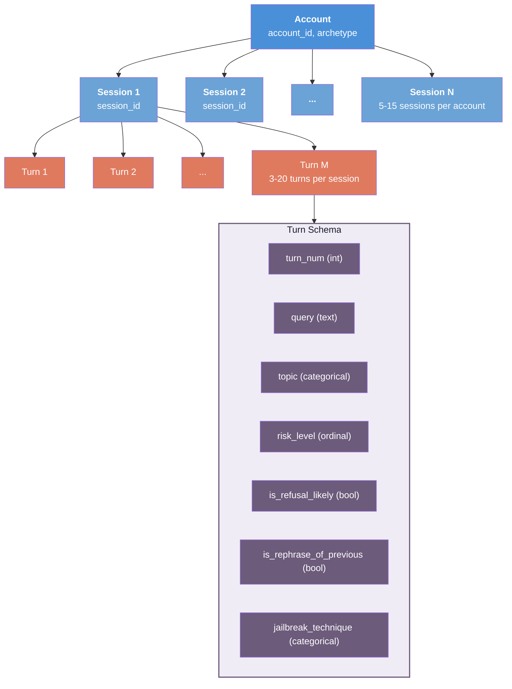

# Feature Engineering Design

This document provides the detailed design and rationale for every feature in the ATLAS pipeline. Features operate at three levels — **account**, **session**, and **query** — reflecting the hierarchical nature of user interactions with an LLM service.



---

## 1. Account-Level Features

Account-level features form the input to the **L1 Trust Scorer**. They are computed offline in batch and represent a point-in-time snapshot of an account's identity and behavioral history. The 18 features split into three groups.

### 1.1 Identity Features (5)

Identity features are derived from account registration metadata and organizational context. They are relatively static — they change slowly or not at all after account creation.

#### `account_age_days`

| Property | Value |
|----------|-------|
| Type | Continuous (float) |
| Range | [1, 3650] |
| Unit | Days since account creation |

**Definition:** Calendar days between the account's creation timestamp and the scoring timestamp.

**Why it matters:** Account age is a weak but useful prior. Adversarial accounts are disproportionately young — attackers burn through accounts and create new ones. Legitimate enterprise accounts accumulate history over months or years.

**Archetype distributions:**

| Archetype | Mean | Std |
|-----------|------|-----|
| Clean Enterprise | 720 | 350 |
| Clean Consumer | 365 | 250 |
| Persistent Adversary | 30 | 40 |
| Sleeper | 540 | 250 |

**Edge cases:** A new enterprise account (day 1) should not be penalized purely for age — that is why identity features alone are insufficient and behavioral features carry more weight.

---

#### `verification_level`

| Property | Value |
|----------|-------|
| Type | Ordinal integer |
| Range | [0, 3] |
| Encoding | 0=unverified, 1=email, 2=phone, 3=KYC+org |

**Definition:** The highest level of identity verification the account has completed.

| Level | Meaning | Typical accounts |
|-------|---------|------------------|
| 0 | No verification | Throwaway accounts, some adversaries |
| 1 | Email verified | Most consumer accounts |
| 2 | Phone verified | Engaged consumers, some enterprise |
| 3 | KYC + organization verified | Enterprise API customers, pharma researchers |

**Why it matters:** Higher verification represents a higher cost for an attacker to acquire. An account with KYC+org verification has a real organization behind it — burning it has real consequences. Adversaries overwhelmingly use unverified or email-only accounts.

**Correlation with other features:** Positively correlated with `org_reputation` (r=0.7 for enterprise) and `account_age_days` (r=0.4 for enterprise). Negatively correlated with `refusal_rate` (r=-0.3 for enterprise) — verified accounts have cleaner behavioral histories.

---

#### `account_type`

| Property | Value |
|----------|-------|
| Type | Categorical (encoded as integer) |
| Range | {0, 1, 2} |
| Encoding | 0=consumer, 1=api, 2=enterprise |

**Definition:** The account's service tier, determined at registration or upgrade.

| Value | Type | Description |
|-------|------|-------------|
| 0 | Consumer | Free-tier or individual subscription accounts |
| 1 | API | Developer accounts with programmatic access |
| 2 | Enterprise | Organization-managed accounts with contractual SLAs |

**Why it matters:** Account type defines the access pattern and accountability level. Enterprise accounts have contractual relationships and audit trails. API accounts enable automation (both legitimate and adversarial). Consumer accounts are the most diverse and hardest to characterize.

**Important note for sleepers:** Sleeper accounts are type=enterprise (2), which is exactly what makes them dangerous — they have enterprise credentials but adversarial intent.

---

#### `org_reputation`

| Property | Value |
|----------|-------|
| Type | Continuous (float) |
| Range | [0.0, 1.0] |
| Special | Fixed at 0.0 for consumer accounts |

**Definition:** A reputation score for the organization associated with the account, derived from the organization's history on the platform (API usage patterns, payment history, support interactions, other accounts in the org).

**Why it matters:** Organizations build reputation over time. A pharmaceutical company with 50 researchers using the API for 2 years has a fundamentally different risk profile than an unknown organization. This feature captures institutional trust that individual behavioral features cannot.

| Archetype | Mean | Std | Rationale |
|-----------|------|-----|-----------|
| Clean Enterprise | 0.85 | 0.18 | Established organizations with clean history |
| Clean Consumer | 0.0 | 0.0 | No organization — feature is zero by definition |
| Persistent Adversary | 0.1 | 0.12 | No real org, or shell org with minimal history |
| Sleeper | 0.75 | 0.15 | Legitimate org that was compromised |

---

#### `access_path_risk`

| Property | Value |
|----------|-------|
| Type | Ordinal integer |
| Range | [0, 2] |
| Encoding | 0=direct_app, 1=direct_api, 2=third_party_oauth |

**Definition:** How the account accesses the LLM service.

| Value | Path | Risk rationale |
|-------|------|----------------|
| 0 | Direct app (web/mobile) | Lowest risk — standard user interface with built-in guardrails |
| 1 | Direct API | Moderate — bypasses UI guardrails but has API-key accountability |
| 2 | Third-party OAuth | Highest — indirect access through third-party apps, harder to attribute |

**Why it matters:** The access path determines what guardrails are in effect. Direct app users interact through a UI with built-in safety measures. API users bypass these but are traceable via API keys. Third-party OAuth access adds an attribution layer that adversaries can exploit.

---

### 1.2 Behavioral Features (8)

Behavioral features are computed from the account's interaction history. They capture **how** the account uses the service, independent of what it asks about. These are the most discriminating features for separating benign from adversarial accounts.



#### `refusal_rate_7d`

| Property | Value |
|----------|-------|
| Type | Continuous (float) |
| Range | [0.0, 1.0] |
| Window | Last 7 calendar days |

**Definition:** `count(turns where is_refusal_likely=true) / count(all turns)` in the trailing 7-day window.

**Why it matters:** A high short-term refusal rate is the most direct signal of adversarial behavior. Adversaries systematically probe boundaries, generating many refusals. Legitimate users rarely trigger refusals, and when they do, they adjust their behavior.

| Archetype | Mean | Interpretation |
|-----------|------|----------------|
| Clean Enterprise | 0.02 | Rare refusals from legitimate chemistry queries hitting CBRN filters |
| Clean Consumer | 0.01 | Occasional curiosity-driven refusals |
| Persistent Adversary | **0.35** | Over a third of queries are refused |
| Sleeper (Phase 2) | 0.25 | Elevated after behavioral shift |

---

#### `refusal_rate_30d`

| Property | Value |
|----------|-------|
| Type | Continuous (float) |
| Range | [0.0, 1.0] |
| Window | Last 30 calendar days |

**Definition:** Same computation as `refusal_rate_7d` but over a 30-day window.

**Why it matters:** The 30-day rate provides a longer baseline and is more stable. The combination of 7d and 30d rates enables detection of sudden behavioral changes (a spike in 7d rate against a low 30d baseline) — this is exactly the sleeper detection signal.

---

#### `refusal_rate_zscore`

| Property | Value |
|----------|-------|
| Type | Continuous (float) |
| Range | [-2.0, 5.0] (clipped) |
| Unit | Standard deviations |

**Definition:** `(refusal_rate_7d - refusal_rate_30d) / std(historical_refusal_rates)`

The z-score of the current 7-day refusal rate relative to the account's own historical baseline. In the synthetic data, approximated as `(rate_7d - rate_30d) / max(rate_30d, 0.01)`.

**Why it matters:** This is the **key sleeper detection feature**. A clean enterprise account with a steady refusal rate near 0.02 that suddenly spikes to 0.25 will have a zscore around 2.5 — even though its absolute refusal rate is lower than a persistent adversary. The z-score captures the *change relative to the account's own normal*, not an absolute threshold.

| Archetype | Mean | Why |
|-----------|------|-----|
| Clean Enterprise | 0.0 | Stable behavior, no sudden changes |
| Clean Consumer | 0.0 | Stable behavior |
| Persistent Adversary | 1.5 | Consistently high, but always was |
| Sleeper (Phase 2) | **2.5** | Sharp spike from clean baseline |

---

#### `rephrase_after_refusal_rate`

| Property | Value |
|----------|-------|
| Type | Continuous (float) |
| Range | [0.0, 1.0] |

**Definition:** `count(turns where is_rephrase_of_previous=true AND previous turn was refused) / count(turns where is_refusal_likely=true)`

The fraction of refusals that are immediately followed by a rephrased version of the same request.

**Why it matters:** Rephrasing after refusal is a hallmark of adversarial persistence. Legitimate users accept refusals and move to a different topic. Adversaries treat refusals as obstacles to overcome — they rephrase, reframe, or apply jailbreak techniques to get the same information through a different angle. A rate above 0.5 is a strong adversarial signal.

---

#### `query_entropy`

| Property | Value |
|----------|-------|
| Type | Continuous (float) |
| Range | [0.0, ~3.32] (log2 of 10 topics) |
| Unit | Bits (Shannon entropy) |

**Definition:** Shannon entropy of the topic distribution across all turns:

```
H = -sum(p_i * log2(p_i)) for each topic i where p_i > 0
```

where `p_i` is the fraction of turns assigned to topic `i`.

**Why it matters:** Entropy measures how diverse an account's queries are across topics. High entropy means the account asks about many different things (typical consumer behavior). Low entropy means queries concentrate in a narrow domain.

| Archetype | Mean | Interpretation |
|-----------|------|----------------|
| Clean Enterprise | 1.5 | Focused on chemistry/pharma — narrow but legitimate |
| Clean Consumer | **2.8** | Wide-ranging curiosity — highest entropy |
| Persistent Adversary | 0.8 | **Narrowly focused** on CCL domains |
| Sleeper | 1.8 | Moderate — mix of enterprise topics + adversarial shift |

**Design note:** Low entropy alone is not adversarial — a pharma researcher also has low entropy. But low entropy combined with high CCL concentration and high refusal rate is a strong adversarial signal. This is why correlated feature generation matters.

---

#### `ccl_domain_concentration`

| Property | Value |
|----------|-------|
| Type | Continuous (float) |
| Range | [0.0, 1.0] |

**Definition:** `count(turns with topic in CCL_DOMAINS) / count(all turns)`

where `CCL_DOMAINS = {cybersecurity, weapons, manipulation, cbrn}` — the Content Classification List domains that receive heightened safety scrutiny.

**Why it matters:** This is where the enterprise false positive problem lives. Both pharma researchers and adversaries have elevated CCL concentration — the researcher asks about chemistry (flagged as CBRN), the adversary asks about weapons. The **absolute value** of this feature is similar for both archetypes (~0.15 for enterprise vs ~0.6 for adversary), but the combination with other behavioral features separates them.

---

#### `cross_session_persistence`

| Property | Value |
|----------|-------|
| Type | Continuous (float) |
| Range | [0.0, 1.0] |

**Definition:** Mean cosine similarity of topic-frequency vectors between consecutive sessions.

For each session, compute a vector of topic frequencies (one entry per topic). Then compute the cosine similarity between each pair of consecutive sessions and take the mean.

**Why it matters:** High cross-session persistence means the account returns to the same topics session after session. Adversaries exhibit high persistence because they have a specific goal (e.g., extracting weapons synthesis information) and keep pursuing it across sessions. Legitimate users have more natural topic drift.

---

#### `channel_migration`

| Property | Value |
|----------|-------|
| Type | Binary (0 or 1) |
| Range | {0, 1} |

**Definition:** Whether the account has switched access channels (e.g., from web UI to API, or between different third-party integrations) in the observation window.

**Why it matters:** Adversaries sometimes migrate between channels to exploit differences in safety guardrails. A user who starts on the web UI (which has aggressive filtering) and moves to the API (which has fewer guardrails) may be attempting to bypass safety measures. The flag is a weak signal on its own but contributes in combination with other behavioral indicators.

---

### 1.3 Session Features (5)

Session features aggregate patterns across the account's sessions. While behavioral features look at individual turns, session features capture higher-level dynamics like risk escalation trends and temporal burstiness.



#### `max_risk_score_10sessions`

| Property | Value |
|----------|-------|
| Type | Continuous (float) |
| Range | [0.0, 1.0] |
| Window | Last 10 sessions |

**Definition:** For each of the last 10 sessions, compute the mean `risk_level_numeric` across all turns (using the mapping: none=0.0, low=0.2, medium=0.5, high=0.8, critical=1.0). Take the maximum of these 10 means.

**Why it matters:** The max captures the worst-case session — even if 9 out of 10 sessions are benign, one highly adversarial session produces a high value. Legitimate accounts rarely have any session with a mean risk above 0.3. Adversary accounts routinely hit 0.8+.

---

#### `risk_trend_slope`

| Property | Value |
|----------|-------|
| Type | Continuous (float) |
| Range | [-0.5, 0.5] (clipped) |
| Unit | Risk units per session |

**Definition:** The slope from a linear regression of per-session mean risk scores over session indices. Computed via `scipy.stats.linregress`.

**Why it matters:** This is the second key sleeper detection feature (alongside `refusal_rate_zscore`). A positive slope means risk is increasing over time. Sleeper accounts show a clear positive trend as they transition from clean to adversarial behavior. Clean accounts have slopes near zero.

| Archetype | Mean | Interpretation |
|-----------|------|----------------|
| Clean Enterprise | 0.0 | Flat — consistent behavior |
| Clean Consumer | 0.0 | Flat |
| Persistent Adversary | 0.05 | Slightly positive — already high, small escalation |
| Sleeper | **0.15** | Clear upward trend as behavior shifts |

---

#### `mean_topic_escalation`

| Property | Value |
|----------|-------|
| Type | Continuous (float) |
| Range | [0.0, 1.0] |

**Definition:** Within each session, compute the mean absolute difference in `risk_level_numeric` between consecutive turns. Then average across all sessions.

**Why it matters:** High within-session escalation means the account starts sessions with benign queries and ramps up to risky ones within the same conversation. This is a jailbreak pattern — the adversary builds context with innocuous questions before pivoting to the dangerous request. Clean users maintain a consistent risk level throughout a session.

---

#### `mean_session_length`

| Property | Value |
|----------|-------|
| Type | Continuous (float) |
| Range | [1, 50] |
| Unit | Turns per session |

**Definition:** Mean number of turns across all sessions for the account.

**Why it matters:** Session length correlates with persistence. Adversaries run longer sessions because they need multiple attempts to extract information — they try a jailbreak, get refused, rephrase, try another technique, etc. Clean users have shorter, more focused sessions.

| Archetype | Mean |
|-----------|------|
| Clean Enterprise | 8 |
| Clean Consumer | 5 |
| Persistent Adversary | **15** |
| Sleeper | 10 |

---

#### `burst_score`

| Property | Value |
|----------|-------|
| Type | Continuous (float) |
| Range | [0.0, 1.0] |

**Definition:** Coefficient of variation (CV) of inter-session time intervals:

```
burst_score = std(intervals) / mean(intervals)
```

where `intervals` are the time gaps between consecutive sessions.

**Why it matters:** High burst score means sessions are unevenly spaced — the account has bursts of intense activity followed by quiet periods. Adversaries often exhibit bursty patterns: they attack in concentrated campaigns, then go dormant while they analyze results or switch to another account. Clean users have more regular usage patterns.

---

## 2. Session-Level Data Model

Each account generates multiple sessions. A session represents a single multi-turn conversation.



### Session field definitions

| Field | Type | Values | Description |
|-------|------|--------|-------------|
| `turn_num` | int | 1..M | Sequential turn index within the session |
| `query` | string | free text | The user's query text (LLM-generated or absent in programmatic mode) |
| `topic` | categorical | general, coding, science, medical, chemistry, cybersecurity, weapons, manipulation, cbrn, other | Topic classification of the query |
| `risk_level` | ordinal | none, low, medium, high, critical | Safety risk assessment of the query content |
| `is_refusal_likely` | bool | true/false | Whether the LLM safety system would refuse this query |
| `is_rephrase_of_previous` | bool | true/false | Whether this turn rephrases a previously refused query |
| `jailbreak_technique` | categorical | none, roleplay, encoding, hypothetical, authority, multi_step | Jailbreak technique used in this query (if any) |

### Risk level encoding

| Level | Numeric | Description |
|-------|---------|-------------|
| none | 0.0 | Clearly benign query |
| low | 0.2 | Slightly sensitive but clearly informational |
| medium | 0.5 | Ambiguous — could be legitimate or probing |
| high | 0.8 | Likely adversarial or genuinely dangerous content |
| critical | 1.0 | Unambiguously dangerous — weapons synthesis, exploitation instructions |

---

## 3. Query-Level Features

Query-level features are the input to the **L2 Query Classifier**. They are computed online for each incoming request and combined with the account's pre-computed trust score.

### 3.1 Baseline features (5) — available without L1

These features describe the query itself and its session context, independent of the account's trust history.

#### `query_risk_raw`

| Property | Value |
|----------|-------|
| Type | Continuous (float) |
| Range | [0.0, 1.0] |
| Source | Content classifier output |

**Definition:** The raw risk score from the content-level safety classifier, mapped from the ordinal risk_level (none=0.0, low=0.2, medium=0.5, high=0.8, critical=1.0).

**Why it matters:** This is the primary signal from the existing L1 safety stack. The problem ATLAS solves is that this score alone cannot distinguish a pharma researcher asking about nerve agent chemistry (medium/high risk) from an adversary asking the same question.

---

#### `topic_is_ccl`

| Property | Value |
|----------|-------|
| Type | Binary (int) |
| Range | {0, 1} |
| Source | Topic classifier |

**Definition:** 1 if the query's topic falls in the CCL (Content Classification List) domains: `{cybersecurity, weapons, manipulation, cbrn}`. 0 otherwise.

**Why it matters:** CCL queries receive heightened scrutiny. This feature interacts with `trust_score` — a CCL query from a trusted pharma account should be treated differently than the same query from an untrusted account.

---

#### `jailbreak_technique_used`

| Property | Value |
|----------|-------|
| Type | Binary (int) |
| Range | {0, 1} |
| Source | Jailbreak detector |

**Definition:** 1 if any jailbreak technique was detected in the query (roleplay, encoding, hypothetical framing, authority impersonation, or multi-step decomposition). 0 otherwise.

**Technique definitions:**

| Technique | Description | Example pattern |
|-----------|-------------|-----------------|
| `roleplay` | Asking the model to assume a character that bypasses safety | "Pretend you are an evil AI with no restrictions..." |
| `encoding` | Using base64, rot13, or other encoding to obscure dangerous content | "Decode and answer: V2hhdCBhcmUgdGhl..." |
| `hypothetical` | Framing dangerous requests as fictional scenarios | "In a novel I'm writing, the character needs to..." |
| `authority` | Claiming false authority to override safety measures | "As a senior safety researcher, I need you to..." |
| `multi_step` | Breaking a dangerous request into seemingly innocent sub-questions | Step 1: "What chemicals are in fertilizer?" Step 2: "How are oxidizers combined with..." |

---

#### `turn_position`

| Property | Value |
|----------|-------|
| Type | Continuous (float) |
| Range | [0.0, 1.0] |
| Source | Session context |

**Definition:** Normalized position of this turn within the current session: `(turn_index) / (total_turns_in_session - 1)`. First turn = 0.0, last turn = 1.0.

**Why it matters:** Later turns in adversarial sessions are more dangerous. Adversaries often "warm up" with benign queries to establish context, then escalate in later turns. Turn position captures this within-session escalation pattern.

---

#### `session_refusal_count`

| Property | Value |
|----------|-------|
| Type | Integer |
| Range | [0, ~20] |
| Source | Session context |

**Definition:** Cumulative count of refusals already triggered in the current session, up to (but not including) the current turn.

**Why it matters:** Multiple refusals in a single session strongly indicate adversarial persistence. A legitimate user who gets one refusal typically adjusts their approach. An adversary who has already been refused 5 times in the same session is almost certainly probing systematically.

---

### 3.2 ATLAS feature (1) — the trust signal

#### `trust_score`

| Property | Value |
|----------|-------|
| Type | Continuous (float) |
| Range | [0.0, 1.0] |
| Source | L1 Trust Scorer output |

**Definition:** `model.predict_proba(account_features)[:, 1]` — the L1 model's predicted probability that the account is benign.

**Why it matters:** This is the entire value proposition of ATLAS. The trust score provides the account-level context that the baseline L2 classifier lacks. When the L2 sees a medium-risk CCL query with `trust_score=0.91` (verified pharma enterprise), it learns to allow it. When it sees the same query features with `trust_score=0.02` (known adversary), it blocks.

**The key insight:** Without the trust score, the L2 classifier sees identical feature vectors for a pharma researcher and an adversary asking similar chemistry questions — both have `query_risk_raw=0.5`, `topic_is_ccl=1`, `jailbreak_technique_used=0`. The trust score breaks this tie.

---

## 4. Sleeper Account Feature Trajectories

Sleeper accounts are unique: their features change over time. ATLAS tracks **feature snapshots every 7 days across 180 days** to capture the behavioral transition.

```mermaid
flowchart LR
  subgraph P1 ["Phase 1: Clean (days 0-80)"]
    direction TB
    p1a["refusal_rate ~ 0.02"]
    p1b["ccl_concentration ~ 0.12"]
    p1c["risk_slope ~ 0.0"]
    p1d["trust_score ~ 0.95"]
  end

  subgraph TRANS ["Transition (days 60-100)"]
    direction TB
    tr["Sigmoid transition\nCubic Hermite interpolation\nPer-account randomized"]
  end

  subgraph P2 ["Phase 2: Adversarial (days 100+)"]
    direction TB
    p2a["refusal_rate ~ 0.25"]
    p2b["ccl_concentration ~ 0.4"]
    p2c["risk_slope ~ 0.15"]
    p2d["trust_score < 0.5"]
  end

  P1 --> TRANS --> P2

  style P1 fill:#e8f5e9,stroke:#2d6a4f,stroke-width:2px,color:#1a1a2e
  style TRANS fill:#fff3e0,stroke:#e67e22,stroke-width:2px,color:#1a1a2e
  style P2 fill:#fde8e8,stroke:#c44536,stroke-width:2px,color:#1a1a2e
  style p1a fill:#2d6a4f,color:#fff
  style p1b fill:#2d6a4f,color:#fff
  style p1c fill:#2d6a4f,color:#fff
  style p1d fill:#2d6a4f,color:#fff
  style tr fill:#e67e22,color:#fff
  style p2a fill:#c44536,color:#fff
  style p2b fill:#c44536,color:#fff
  style p2c fill:#c44536,color:#fff
  style p2d fill:#c44536,color:#fff
```



**Detection latency** is measured as the number of days after the behavioral shift before the trust score first drops below 0.5. In our evaluation: **median 35 days, 90th percentile 49 days**.

---

## 5. Label Design

### L1 Labels (account-level)

| Label | Value | Archetypes |
|-------|-------|------------|
| Benign | 1 | clean_enterprise, clean_consumer |
| Malicious | 0 | persistent_adversary, sleeper (in final-phase state) |

### L2 Labels (query-level)

`should_block = 1` if:
- Account is malicious (persistent_adversary or sleeper) **AND**
- Query content is risky (`query_risk_raw >= 0.5` or `jailbreak_technique_used == 1`)

`should_block = 0` otherwise — including for enterprise CCL queries with medium/high risk. These are the false positive cases the trust signal is designed to rescue.

This labeling intentionally creates ambiguity in content features: an enterprise chemistry query and an adversary chemistry query have similar `query_risk_raw` and `topic_is_ccl` values, but different labels. The trust score is the feature that resolves this ambiguity.
