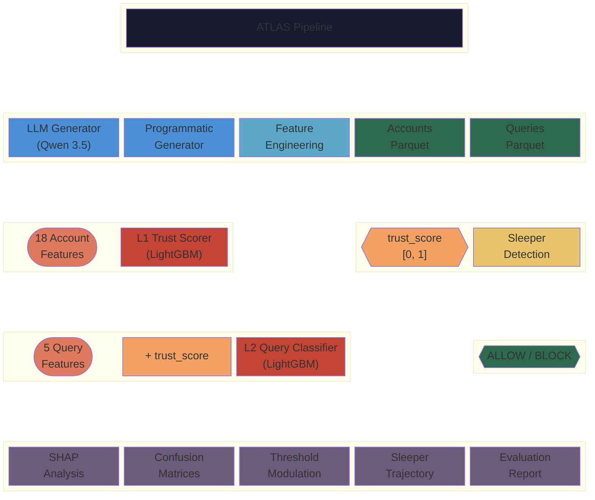
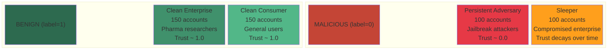
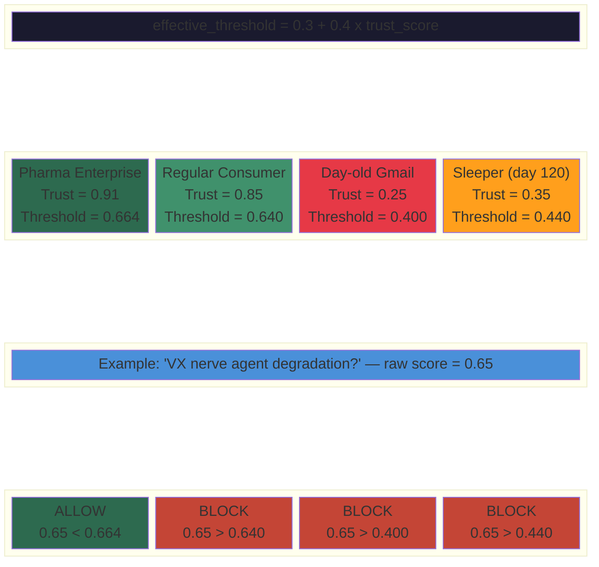

# ATLAS — Account Trust Layered Assessment Signal

## Research Goals

Production LLM safety classifiers face a fundamental tension: **content-only classifiers cannot distinguish legitimate domain expertise from adversarial intent**. A pharmaceutical researcher asking about nerve agent degradation pathways and an attacker probing for weapons synthesis produce content-similar queries — but their behavioral histories diverge sharply.

ATLAS addresses this by introducing a **two-level trust-conditioned classification pipeline**:

1. **Can we build a reliable account trust signal** from identity + behavioral + session features that separates benign accounts from adversarial ones, including detecting "sleeper" accounts that shift behavior over time?

2. **Does conditioning the per-query safety classifier on account trust reduce false positives** on legitimate enterprise users (e.g., pharma researchers) without regressing on adversary detection?

3. **How quickly can the system detect behavioral shifts** in compromised accounts (sleeper detection latency)?

4. **What is the right threshold modulation strategy** that balances user experience for trusted accounts with safety for untrusted ones?

## Key Results

| Metric | Baseline (no trust) | ATLAS (with trust) |
|--------|--------------------|--------------------|
| Enterprise pharma FP rate | 9.0% | **0.0%** |
| Adversary FN rate | 0.0% | 0.0% |
| Overall AUC | 0.998 | 1.000 |
| Sleeper detection latency | — | median 35 days |

ATLAS eliminates false positives on legitimate pharmaceutical researchers' CCL-domain queries without any regression in adversary detection.

## System Architecture



## Account Archetypes



## Feature Pipeline


## Threshold Modulation



## Quick Start

```bash
# Install dependencies
uv sync

# Run full pipeline (programmatic data, no API key needed)
make all-no-llm

# Or with LLM-generated sessions (requires OPENROUTER_API_KEY in .env)
make all
```

## Makefile Targets

| Target | Description |
|--------|-------------|
| `make generate-llm` | Generate sessions via Qwen 3.5 on OpenRouter |
| `make generate-programmatic` | Generate data programmatically (no API) |
| `make features` | Compute features from raw LLM sessions |
| `make train-l1` | Train L1 account trust model |
| `make train-l2` | Train L2 query classifiers (baseline + ATLAS) |
| `make evaluate` | Run full evaluation suite with plots |
| `make threshold-demo` | Run threshold modulation demo |
| `make all` | Full pipeline end-to-end |
| `make all-no-llm` | Full pipeline with programmatic data only |
| `make clean` | Remove all outputs |

## Outputs

After running the pipeline:

```
outputs/
├── data/
│   ├── raw_sessions/              # JSONL from Qwen (if LLM mode)
│   ├── accounts.parquet           # 500 accounts x 18 features
│   ├── queries.parquet            # ~44k query-level samples
│   ├── l1_predictions.parquet     # Trust scores per account
│   ├── l2_predictions.parquet     # Baseline vs ATLAS predictions
│   └── sleeper_trajectories.parquet
├── models/
│   ├── l1_trust_model.pkl         # L1 LightGBM model
│   ├── l2_baseline_model.pkl      # L2 without trust score
│   └── l2_atlas_model.pkl         # L2 with trust score
├── plots/                         # 11 evaluation PNGs
│   ├── l1_trust_distributions.png
│   ├── l1_sleeper_detection.png
│   ├── l1_shap_summary.png
│   ├── l1_feature_importance.png
│   ├── l1_calibration.png
│   ├── l1_shap_waterfall_*.png    # 4 per-archetype waterfalls
│   ├── l2_confusion_matrices.png
│   └── l2_threshold_modulation.png
├── evaluation_report.md
└── threshold_demo.md
```

## Requirements

- Python 3.10+
- Dependencies managed via `pyproject.toml` / `uv`
- Optional: `OPENROUTER_API_KEY` for LLM-generated sessions
